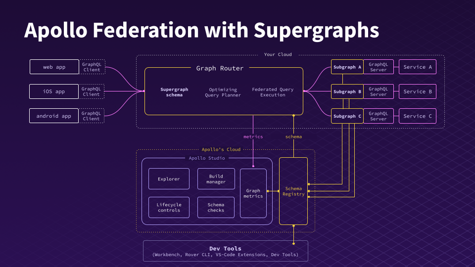
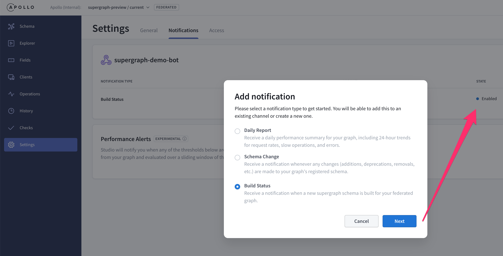
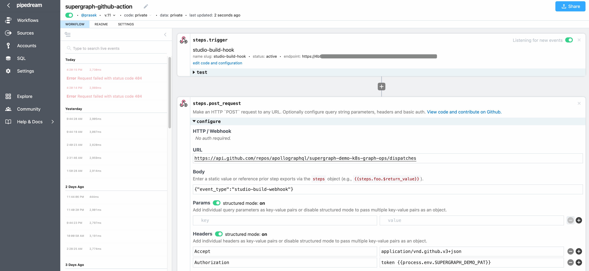
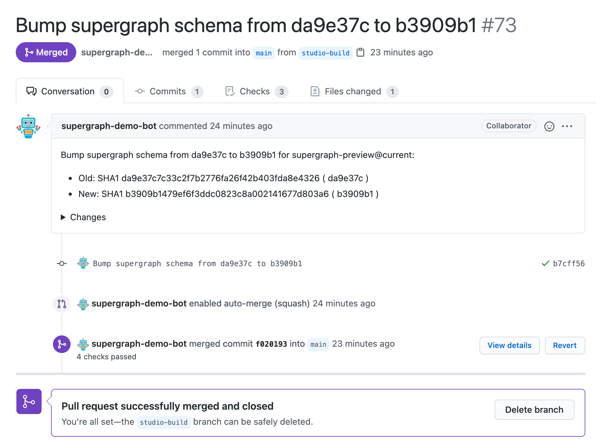

# Kubernetes-native GraphOps

This is the `config repo` for the [apollographq/supergraph-demo](https://github.com/apollographql/supergraph-demo) `source repo`.




Contents:

* [Welcome](#welcome)
* [Overview](#overview)
* [Sourcing Supergraph Schemas from Managed Federation](#sourcing-supergraph-schemas-from-managed-federation)
* [Deploying to Kubernetes](#deploying-to-kubernetes)

## Welcome
Large-scale graph operators use Kubernetes to run their Graph Router and Subgraph Services, with continuous app and service delivery. Kubernetes provides a mature control-plane for deploying and operating your graph using the container images produced by the [supergraph-demo](https://github.com/apollographql/supergraph-demo) `source repo` -- which propagates new docker image versions to this [supergraph-demo-k8s-graphops](https://github.com/apollographql/supergraph-demo-k8s-graphops) `config repo`. 

This `config repo` shows how to use `kustomize` and GitOps to deploy your graph in Kubernetes for `dev`, `stage`, and `prod` environments. The 

It follows the [Declarative GitOps CD for Kubernetes Best Practices](https://argoproj.github.io/argo-cd/user-guide/best_practices/):

* `source repo`
  * [apollographq/supergraph-demo](https://github.com/apollographql/supergraph-demo) produces the artifacts:
  * subgraph docker images w/ embedded subgraph schemas
  * supergraph-router docker image that can be fed a composed supergraph schema via
    * (a) Apollo Uplink - for update in place
    * (b) via a `ConfigMap` for declarative k8s config management
  * CI:
    * auto bumps package version numbers & container tags
    * builds/publishes container images to container registry
    * creates PRs to propagate candidate configs and version bumps to `config repo`

* `config repo`
  * has the full k8s configs for dev, stage, and prod environments:
    * cluster - base cluster & GitOps config
    * infra - nginx, etc.
    * router - supergraph router config
    * subgraphs - products, inventory, users
  * supports promoting config from dev -> stage -> prod
    * `make promote-dev-stage`
    * `make promote-stage-prod`
  * CD:
    * via GitOps operators like [Flux](https://fluxcd.io/) and [ArgoCD](https://argoproj.github.io/argo-cd/)
    * using progressive delivery controllers like [Argo Rollouts](https://argoproj.github.io/argo-rollouts/) and [Flagger](https://flagger.app/)
    * or your favorite tools!

If you're not familiar with `kustomize` and k8s-native config management, checkout the following:

* [https://kustomize.io/](https://kustomize.io/).
* [kustomize helm example](https://github.com/fluxcd/flux2-kustomize-helm-example)
* [multi-tenancy example](https://github.com/fluxcd/flux2-multi-tenancy)
* [best-practices discussion thread](https://github.com/fluxcd/flux/issues/1071)

## Overview

This `config repo` contains the Kubernetes config resources for `dev`, `stage` and `prod`.

It sources the following artifacts:
* container image versions published to DockerHub
* supergraph schema versions published to Apollo Studio

`kustomize` is used to apply the sourced container image versions and supergraph schema into the configuration resource for `dev`, `stage`, and `prod`.

Configuration can be applied via `kubectl`, GitOps, or any deployment tooling that works with declarative Kubernetes resources.

In more detail:
* `config repo` PR is opened (auto-merge):
  * `Bump image versions` when new Gateway docker image versions are published:
    * see end of the [example monorepo release workflow](https://github.com/apollographql/supergraph-demo/blob/main/.github/workflows/release.yml)
    * bumps package versions in this `source repo`.
    * does an incremental monorepo build and pushes new docker images to DockerHub.
    * opens `config repo` PR to bump the docker image versions in the `dev` environment (auto-merge).
* `config repo` PR is opened (auto-merge):
  * `Bump supergraph schema` when published by Managed federation
    * using above techniques: webhook, `rover supergraph fetch`
* `kustomize` generates
  * new supergraph `ConfigMap`
  * updated Gateway `Deployment` which references
    * supergraph `ConfigMap`
    * Gateway image versions
* deployment via:
  * `kubectl apply` in place - resulting in a [rolling upgrade](https://github.com/kubernetes-sigs/kustomize/blob/master/examples/configGeneration.md)
  * GitOps tools like [ArgoCD](https://argoproj.github.io/) and [Flux](https://fluxcd.io/)
  * Progressive delivery controllers like [Argo Rollouts](https://argoproj.github.io/argo-rollouts/) or [Flagger](https://flagger.app/)
    * Supports `BlueGreen` and `Canary` deployment strategies
* rollback by rolling back in git to a deployment config that uses a previous supergraph.graphql for a given environment `dev`, `stage`, `prod`.
* separation of concerns between developer repos and ops config repos.
* full audit trail

## Sourcing Supergraph Schemas from Managed Federation

1. Detecting changes to the supergraph built via Managed Federation

   * Managed Federation builds a supergraph schema after each `rover subgraph publish`
   * Changes detected with the following:
     * [Supergraph build webhooks](https://www.apollographql.com/blog/announcement/webhooks/) - when a new supergraph schema is built in Apollo Studio
     * `rover supergraph fetch` - to poll the Registry

2. `Bump supergraph schema` PR with auto-merge enabled when changes detected
   * Workflow: [supergraph-build-webhook.yml](https://github.com/apollographql/supergraph-demo-k8s-graphops/blob/main/.github/workflows/supergraph-build-webhook.yml)
   * Commits a new supergraph.graphql to the `config repo` with the new version from Apollo Studio
   * Additional CI checks on the supergraph schema are required for the PR to merge
   * Auto-merged when CI checks pass

3. Generate a new Gateway `Deployment` and `ConfigMap` using `kustomize`
   * Once changes to `supergraph.graphql` when `Bump supergraph schema` is merged

#### Gateway CD: Custom - Detailed Steps

1. Register the webhook in Apollo Studio in your graph settings
   * Send the webhook to an automation service or serverless function:
   * 

2. Adapt the webhook to a GitHub `repository_dispatch` POST request
   * Create a webhook proxy that passes a `repo` scoped personal access token (PAT)
   * Using a [GitHub machine account](https://github.com/peter-evans/create-pull-request/blob/main/docs/concepts-guidelines.md#workarounds-to-trigger-further-workflow-runs) with limited access:
   * 

3. `repository_dispatch` event triggers a GitHub workflow
   * [supergraph-build-webhook.yml](https://github.com/apollographql/supergraph-demo-k8s-graphops/blob/main/.github/workflows/supergraph-build-webhook.yml)
   * uses both `repository_dispatch` and `scheduled` to catch any lost webhooks:
   * 

4. GitHub workflow automatically creates a PR with auto-merge enabled
   * [supergraph-build-webhook.yml](https://github.com/apollographql/supergraph-demo-k8s-graphops/blob/main/.github/workflows/supergraph-build-webhook.yml)
   * using a GitHub action like [Create Pull Request](https://github.com/marketplace/actions/create-pull-request) - see [concepts & guidelines](https://github.com/peter-evans/create-pull-request/blob/main/docs/concepts-guidelines.md)
   * 
   * uses `kustomize` to generate:
     * a new supergraph schema `ConfigMap`
     * a new Gateway `Deployment` that references the new `ConfigMap`

5. Apply the updated Gateway `Deployment` and supergraph `ConfigMap` to `dev`
6. Promote config from `dev` -> `stage` -> `prod`

## Deploying to Kubernetes

You'll need:

* [kubectl](https://kubernetes.io/docs/tasks/tools/) - with expanded `kustomize` support for `resources`
* [kind](https://kind.sigs.k8s.io/docs/user/quick-start/#installation)

then run:

```sh
make demo-k8s
```

which creates:

* local k8s cluster with the NGINX Ingress Controller
* graph-router `Deployment` configured to use a supergraph `ConfigMap`
* graph-router `Service` and `Ingress`

and applies the following:

```
kubectl apply -k infra/dev
kubectl apply -k subgraphs/dev
kubectl apply -k router/dev
```

using [router/base/router.yaml](router/base/router.yaml):

```yaml
apiVersion: apps/v1
kind: Deployment
metadata:
  labels:
    app: router
  name: router-deployment
spec:
  replicas: 1
  selector:
    matchLabels:
      app: router
  template:
    metadata:
      labels:
        app: router
    spec:
      containers:
      - env:
        - name: APOLLO_SCHEMA_CONFIG_EMBEDDED
          value: "true"
        image: prasek/supergraph-router:1.1.1
        name: router
        ports:
        - containerPort: 4000
        volumeMounts:
        - mountPath: /etc/config
          name: supergraph-volume
      volumes:
      - configMap:
          name: supergraph-c4mh62bddt
        name: supergraph-volume
---
apiVersion: v1
kind: ConfigMap
metadata:
  name: supergraph-c4mh62bddt
data:
  supergraph.graphql: |
    schema
      @core(feature: "https://specs.apollo.dev/core/v0.1"),
      @core(feature: "https://specs.apollo.dev/join/v0.1")
    {
      query: Query
    }

    directive @core(feature: String!) repeatable on SCHEMA

    directive @join__field(graph: join__Graph, requires: join__FieldSet, provides: join__FieldSet) on FIELD_DEFINITION

    directive @join__type(graph: join__Graph!, key: join__FieldSet) repeatable on OBJECT | INTERFACE

    directive @join__owner(graph: join__Graph!) on OBJECT | INTERFACE

    directive @join__graph(name: String!, url: String!) on ENUM_VALUE

    type DeliveryEstimates {
      estimatedDelivery: String
      fastestDelivery: String
    }

    scalar join__FieldSet

    enum join__Graph {
      INVENTORY @join__graph(name: "inventory" url: "http://inventory:4000/graphql")
      PRODUCTS @join__graph(name: "products" url: "http://products:4000/graphql")
      USERS @join__graph(name: "users" url: "https://users:4000/graphql")
    }

    type Product
      @join__owner(graph: PRODUCTS)
      @join__type(graph: PRODUCTS, key: "id")
      @join__type(graph: PRODUCTS, key: "sku package")
      @join__type(graph: PRODUCTS, key: "sku variation{id}")
      @join__type(graph: INVENTORY, key: "id")
    {
      id: ID! @join__field(graph: PRODUCTS)
      sku: String @join__field(graph: PRODUCTS)
      package: String @join__field(graph: PRODUCTS)
      variation: ProductVariation @join__field(graph: PRODUCTS)
      dimensions: ProductDimension @join__field(graph: PRODUCTS)
      createdBy: User @join__field(graph: PRODUCTS, provides: "totalProductsCreated")
      delivery(zip: String): DeliveryEstimates @join__field(graph: INVENTORY, requires: "dimensions{size weight}")
    }

    type ProductDimension {
      size: String
      weight: Float
    }

    type ProductVariation {
      id: ID!
    }

    type Query {
      allProducts: [Product] @join__field(graph: PRODUCTS)
      product(id: ID!): Product @join__field(graph: PRODUCTS)
    }

    type User
      @join__owner(graph: USERS)
      @join__type(graph: USERS, key: "email")
      @join__type(graph: PRODUCTS, key: "email")
    {
      email: ID! @join__field(graph: USERS)
      name: String @join__field(graph: USERS)
      totalProductsCreated: Int @join__field(graph: USERS)
    }
---
apiVersion: v1
kind: Service
metadata:
  name: router-service
spec:
  ports:
  - port: 4000
    protocol: TCP
    targetPort: 4000
  selector:
    app: router
---
apiVersion: networking.k8s.io/v1
kind: Ingress
metadata:
  annotations:
    kubernetes.io/ingress.class: nginx
  name: router-ingress
spec:
  rules:
  - http:
      paths:
      - backend:
          service:
            name: router-service
            port:
              number: 4000
        path: /
        pathType: Prefix
```

and 3 subgraph services [subgraphs/base/subgraphs.yaml](subgraphs/base/subgraphs.yaml):

`make demo-k8s` then runs the following in a loop until the query succeeds or 2 min timeout:

```sh
kubectl get all
make k8s-query
```

which shows the following:

```
NAME                                     READY   STATUS    RESTARTS   AGE
pod/inventory-65494cbf8f-bhtft           1/1     Running   0          59s
pod/products-6d75ff449c-9sdnd            1/1     Running   0          59s
pod/router-deployment-84cbc9f689-8fcnf   1/1     Running   0          20s
pod/users-d85ccf5d9-cgn4k                1/1     Running   0          59s

NAME                     TYPE        CLUSTER-IP      EXTERNAL-IP   PORT(S)    AGE
service/inventory        ClusterIP   10.96.108.120   <none>        4000/TCP   59s
service/kubernetes       ClusterIP   10.96.0.1       <none>        443/TCP    96s
service/products         ClusterIP   10.96.65.206    <none>        4000/TCP   59s
service/router-service   ClusterIP   10.96.178.206   <none>        4000/TCP   20s
service/users            ClusterIP   10.96.98.53     <none>        4000/TCP   59s

NAME                                READY   UP-TO-DATE   AVAILABLE   AGE
deployment.apps/inventory           1/1     1            1           59s
deployment.apps/products            1/1     1            1           59s
deployment.apps/router-deployment   1/1     1            1           20s
deployment.apps/users               1/1     1            1           59s

NAME                                           DESIRED   CURRENT   READY   AGE
replicaset.apps/inventory-65494cbf8f           1         1         1       59s
replicaset.apps/products-6d75ff449c            1         1         1       59s
replicaset.apps/router-deployment-84cbc9f689   1         1         1       20s
replicaset.apps/users-d85ccf5d9                1         1         1       59s
Smoke test
-------------------------------------------------------------------------------------------
++ curl -X POST -H 'Content-Type: application/json' --data '{ "query": "{ allProducts { id, sku, createdBy { email, totalProductsCreated } } }" }' http://localhost:80/
  % Total    % Received % Xferd  Average Speed   Time    Time     Time  Current
                                 Dload  Upload   Total   Spent    Left  Speed
100   352  100   267  100    85   3000    955 --:--:-- --:--:-- --:--:--  3911
{"data":{"allProducts":[{"id":"apollo-federation","sku":"federation","createdBy":{"email":"support@apollographql.com","totalProductsCreated":1337}},{"id":"apollo-studio","sku":"studio","createdBy":{"email":"support@apollographql.com","totalProductsCreated":1337}}]}}
Success!
-------------------------------------------------------------------------------------------
```

`make demo-k8s` then cleans up:

```
deployment.apps "graph-router" deleted
service "graphql-service" deleted
ingress.networking.k8s.io "graphql-ingress" deleted
Deleting cluster "kind" ...
```

## Learn More

Checkout the [apollographq/supergraph-demo](https://github.com/apollographql/supergraph-demo) `code repo`.

Learn more about how Apollo can help your teams ship faster here: https://www.apollographql.com/docs/studio/.
